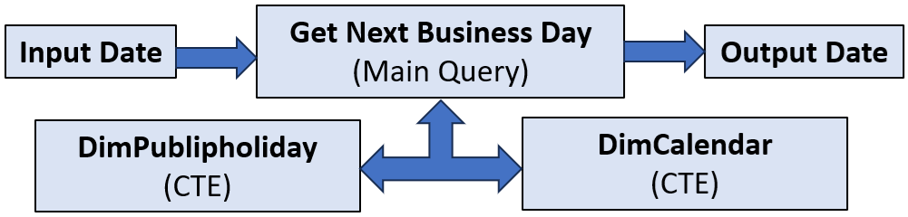
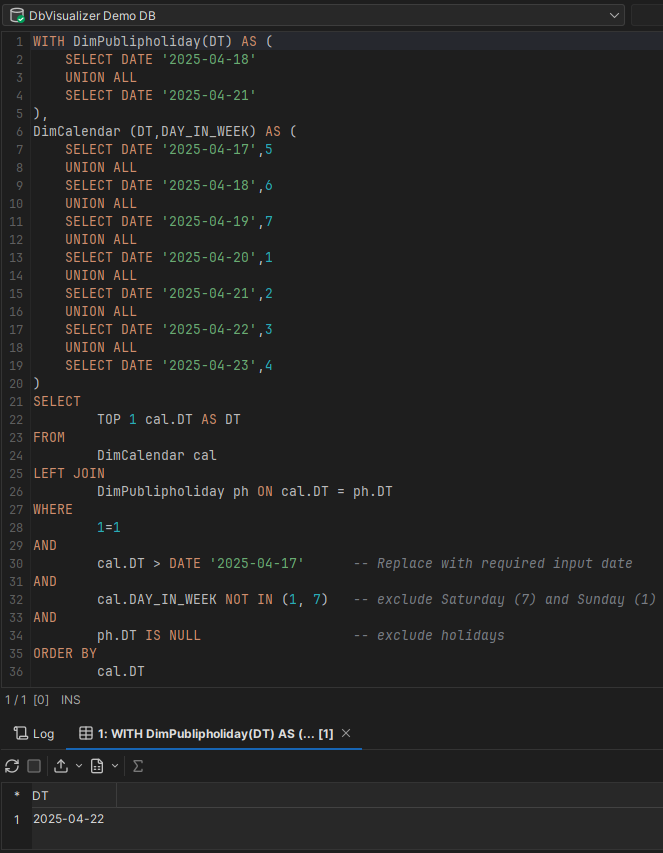

# &#x1F4BC; Using SQL to Find the Next Business Day: A Real-World Solution for Customer Notifications



In modern business systems, seemingly simple requirements can quickly evolve into complex logic—especially when calendars, weekends, and holidays come into play. One such scenario came up in a project where I needed to send automated email notifications to customers, but only on valid business days.

This blog post explores how I approached this challenge using clean SQL logic and two well-designed dimension tables: DimCalendar and DimPublicHoliday. 

## &#x1F4CC; The Business Requirement 

Our system was set up to generate certain email notifications triggered by events such as overdue payments, service updates, or document availability. However, the business mandated that no emails should be sent out on weekends or Victorian public holidays. If an event occurred on a non-business day, the notification had to be deferred to the next valid business day.

## 🧩 The Data Model

To support this, I had two key dimension tables:

    DimCalendar: A master calendar table that includes all dates and metadata like day of the week, month, year, etc. One crucial column was DAY_IN_WEEK, where:

        1 = Sunday

        2 = Monday

        ...

        7 = Saturday

    DimPublicHoliday: A table that listed all Victorian public holidays. It included dates and descriptions of holidays like Labour Day, Anzac Day, and Melbourne Cup.

## 🔍 The Challenge

Given an arbitrary date (say, the date an event was triggered), how can I determine the next available business day?

The logic needed to:

    Skip weekends (Saturday and Sunday).

    Skip Victorian public holidays.

    Return the next earliest date that meets both conditions.

## ✅ The SQL Solution

I implemented the following SQL logic to find the next available business day. Please note that I am using a stripped down version of Calendar and Public Holiday table. 

```
WITH DimPublipholiday(DT) AS (
    SELECT DATE '2025-04-18'            -- Easter Friday   
    UNION ALL
    SELECT DATE '2025-04-21'            -- Easter Monday   
),
DimCalendar (DT,DAY_IN_WEEK) AS (
    SELECT DATE '2025-04-17',5
    UNION ALL
    SELECT DATE '2025-04-18',6
    UNION ALL
    SELECT DATE '2025-04-19',7
    UNION ALL
    SELECT DATE '2025-04-20',1
    UNION ALL
    SELECT DATE '2025-04-21',2
    UNION ALL
    SELECT DATE '2025-04-22',3
    UNION ALL
    SELECT DATE '2025-04-23',4
)
SELECT
        TOP 1 cal.DT
FROM 
        DimCalendar cal
LEFT JOIN 
        DimPublipholiday ph ON cal.DT = ph.DT
WHERE 
        1=1 
AND
        cal.DT > DATE '2025-04-17'      -- Replace with required input date
AND 
        cal.DAY_IN_WEEK NOT IN (1, 7)   -- exclude Saturday (7) and Sunday (1)
AND 
        ph.DT IS NULL                   -- exclude public holidays
ORDER BY 
        cal.DT
```

## 🧠 How It Works

    1. DimPublipholiday CTE provides all public holiday dates.
    
    2. DimCalendar CTE provides all calendar dates, along with their day in week number.

    3. The main query uses an input date and the above two CTE's to filter out any upcoming weekends and public holidays to return first available valid next business day.

    📌 In production, I parameterized the input date and embedded this logic into a stored procedure that powered a notification scheduling system.

## &#10145; Output

Here is the entire script running in DBVisualizer to product the required output.



## 🚀 Outcome and Benefits

By building this logic directly into the SQL layer:

    1. I offloaded complexity from the application code.

    2. I ensured consistent and auditable business-day logic across multiple services.

    3. The system became calendar-aware, aligning fully with business expectations.

## 👏 Final Thoughts

This example showcases how a clean data model, combined with SQL filtering logic, can solve real-world problems in a maintainable way. Whether it's handling holidays or business logic boundaries, date intelligence is critical to any enterprise application.

It is critical to invest in a proper DimCalendar and DimPublicHoliday strategy when working on time-sensitive systems.

Please let me know your thoughts, comments and any feedback about this blog.

Thanks for your time, and see you soon on another blog.